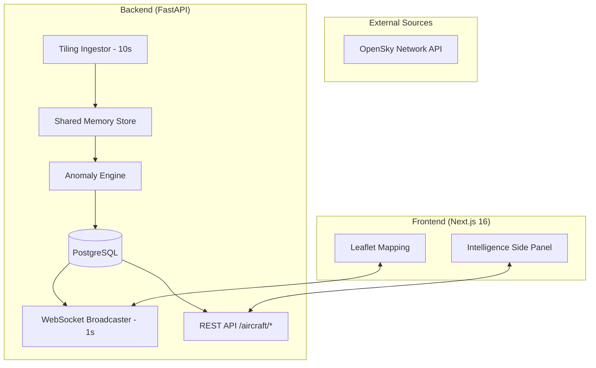

<<<<<<< HEAD
# 🛰️ AeroIntel: Real-Time Aviation Intelligence & Anomaly Surveillance

**AeroIntel** is a professional-grade aviation monitoring and intelligence platform designed to track, analyze, and visualize global aircraft traffic in real-time. By leveraging high-fidelity ADS-B (Automatic Dependent Surveillance–Broadcast) state vectors from the **OpenSky Network**, the platform detects navigational anomalies, emergency scenarios, and performance envelope violations.

---

## 🚀 Project Overview

At its core, AeroIntel transforms raw flight data into actionable intelligence. The system monitors thousands of aircraft across multiple continents (Asia, Europe, USA, Middle East) using a distributed regional tiling architecture. It is built to maintain a high-performance, low-latency data pipeline that serves both historical analysis and instantaneous situational awareness.

---

## 🛠️ What We Have Built So Far

### 1. **Robust Ingestion Pipeline (The Data Heart)**
*   **Regional Tiling Engine**: Implemented a multi-region polling system that fetches data for major aviation hubs (India, Europe, North America, Middle East) sequentially to maximize coverage while staying within API limits.
*   **Optimized Session Management**: Uses persistent `requests.Session` with **HTTP Basic Authentication** and connection pooling to ensure reliability and speed.
*   **Fault-Tolerant Polling**: 
    *   **10-20s Polling Intervals**: Balanced for data density and OpenSky policy compliance.
    *   **Exponential 429 Backoff**: Automatically detects rate-limiting (HTTP 429) and implement a 30s-120s cooldown period to protect the source IP.
    *   **Stale-Cache Protection**: If an ingestion cycle fails, the system continues to serve the last valid snapshot using in-memory interpolation.

### 2. **Shared Memory Intelligence (State Management)**
*   **Centralized State Store**: Created a `shared_state.py` module to manage aircraft caches as a single memory instance, resolving Python's modular reference bugs and ensuring the API/WebSocket always sees the same dataset as the Ingestion worker.
*   **Strict Mutation Policy**: Updates use `.clear()` and `.extend()` on list instances to preserve memory references across decoupled modules.

### 3. **Real-Time Streaming Layer (WebSockets)**
*   **High-Frequency Broadcaster**: A dedicated WebSocket service (`/ws/aircraft/live`) that pushes the entire regional snapshot to clients every **1-2 seconds**.
*   **Position Interpolation (Dead Reckoning)**: Backend logic calculates predicted aircraft positions based on velocity and heading during the gaps between 15s API polls, providing "fluid 60fps" movement on the radar.

### 4. **Intelligence & Anomaly Detection Engine**
*   **Rules-Based Analysis**: A modular engine (`alerts_engine.py`) that evaluates each aircraft vector against:
    *   **Unrealistic Speed**: Detection of aircraft exceeding 700 knots (transponder errors or physical anomalies).
    *   **Vertical Anomaly**: Flags sudden altitude changes exceeding 8,000 feet in a 10s window (emergency descents or sensor failure).
    *   **Teleport Anomaly**: Detects rapid coordinate jumps (>50km) between snapshots.
    *   **Emergency Squawk Monitoring**: Logic ready to flag 7700 (General Emergency), 7600 (Comm Failure), and 7500 (Hijack).
*   **Threat Scoring**: Each aircraft is assigned a dynamic risk percentage based on the severity and frequency of detected anomalies.

### 5. **Lifecycle & Data Management**
*   **Auto-Expiry Jobs**: A background task cleans the DB every 30s, removing aircraft not updated for >180s.
*   **Cursor-Based Alert Feed**: Implemented a `since` parameter for incremental alert polling, ensuring the dashboard only fetches the "new delta" of anomalies without re-rendering history.

### 6. **High-Fidelity GIS Frontend**
*   **Next.js 16 UI**: A modern, dark-themed dashboard focused on spatial clarity and "Active Intelligence."
*   **Interactive Radar**:
    *   **Icon Rotation**: Aircraft markers are oriented using true `heading_deg`.
    *   **Trajectory Trails**: Clicking an aircraft renders a dashed **Polyline** trail of its last 30 historical positions.
    *   **Hydration-First Design**: Solved SSR hydration mismatches using a client-side localized `ClientTime` component.

---

## 🧭 Aviation Domain Concepts Integrated

*   **ADS-B (Automatic Dependent Surveillance–Broadcast)**: The primary data source where aircraft transmit their position, altitude, and speed via satellite or ground stations.
*   **ICAO24 (Hex Code)**: A unique 24-bit identifier assigned to each aircraft transponder, used by AeroIntel as the Primary Key for tracking across cycles.
*   **State Vector**: A periodic "heartbeat" of an aircraft containing its position, altitude (barometric or GPS), ground speed, and track (heading).
*   **Flight Envelope**: The aerodynamic limits of an aircraft. Our anomalies engine detects when data suggests an aircraft has exited this envelope (e.g., impossible vertical speed).
*   **Squawk Code**: A four-digit transponder code used by pilots to communicate status to ATC (Air Traffic Control).

---

## 🏗️ Technical Architecture



---

## 🔮 Future Roadmap

*   **🛡️ Restricted Geofencing**: Integration of GeoJSON boundary data to alert when civilian aircraft enter restricted or military airspaces.
*   **🤖 ML-Driven Path Prediction**: Using historical trajectories to predict future position should the ADS-B signal drop (Dead Reckoning 2.0).
*   **☁️ Weather Correlation**: Overlaying live METAR/TAF weather data to correlate anomalies (like turbulence or rapid descent) with severe weather patterns.
*   **📋 Flight Metadata Enrichment**: Linking ICAO24 codes with external airline databases to display Boeing/Airbus model types, owner info, and tail numbers (N-Numbers).

---

## 🛠️ Getting Started

### 1. Requirements
*   Python 3.9+
*   PostgreSQL (with optional PostGIS)
*   Node.js 18+

### 2. Environment Setup
Create a `.env` file in the root:
```bash
OPENSKY_USERNAME=your_username
OPENSKY_PASSWORD=your_password
DATABASE_URL=postgresql://user@localhost:5432/opensky_hunter
```

### 3. Execution
**Backend:**
```bash
uvicorn app:app --reload
```

**Frontend:**
```bash
npm run dev
```

---

**Developed for Advanced Aviation Monitoring & Intelligence Surveillance.**
=======
# AeroIntel

A real-time aircraft intelligence and anomaly detection platform built on top of live ADS-B state vectors from the **OpenSky Network**.

This project is **NOT a flight tracker clone**.  

It is an **aviation intelligence engine** that ingests raw ADS-B telemetry, builds a spatial database, detects anomalies, and streams live aircraft intelligence to an interactive map UI.

### NOTE - What is ADS-B

> **Automatic Dependent Surveillance–Broadcast (ADS-B)** is an advanced, satellite-based aviation surveillance technology where aircraft determine their position via GPS and periodically broadcast it—along with speed, altitude, and identity—to ground stations and other aircraft.

----------

## 🧠 What This Project Really Is

Other's Project:

> “Map + planes from API”

This Project:

> **ADS-B ingestion → spatial DB → anomaly engine → real-time intelligence UI**

This is the **foundation used by real surveillance / aviation analytics systems**.

----------

## 🏗️ System Architecture


```
OpenSky (ADS-B states)  
 ↓  
Ingestion Worker (polling + parsing)  
 ↓  
Database (aircraft state store)  
 ↓  
Detection / Alerts Engine  
 ↓  
REST + WebSocket APIs  
 ↓  
Next.js Intelligence UI (Leaflet Map)
```


----------

## 📡 Data Source

-   Live aircraft telemetry from **OpenSky Network** (via API)
-   State vectors: position, altitude, velocity, heading, squawk, callsign
-   Polled at fixed intervals
-   Parsed into structured aircraft state

----------

## ⚙️ Backend (FastAPI)

### Responsibilities

-   Poll OpenSky every N seconds
-   Parse and normalize ADS-B states
-   Store latest aircraft state
-   Detect anomalies
-   Expose REST endpoints
-   Broadcast live updates via WebSocket

----------

### Core Components

#### 1. Ingestion Worker

Continuously polls OpenSky and updates aircraft state.

Handles:

-   Rate limiting (429 handling)
-   JSON parsing failures
-   Retry/backoff
-   Bounding box optimization

----------

#### 2. Aircraft State Store

Each aircraft is tracked by **ICAO hex**:

```json
{  
 "icao": "488252",  
 "callsign": "SAH48P",  
 "lat": 28.44,  
 "lon": 77.02,  
 "altitude": 10668,  
 "velocity": 215.6,  
 "heading": 181.2,  
 "last_seen": "timestamp"  
}
```

----------


----------

## 🌐 Frontend (Next.js + Leaflet)

### Features

-   Dark tactical map
-   Aircraft plotted from live API
-   Real-time map updates
-   Alerts panel
-   System status panel
-   Intelligence dashboard

### Map Engine

Built with **Leaflet** and **OpenStreetMap** tiles.

Aircraft are rendered as markers using live state updates.

----------

## 🚨 Priority Alerts Panel

Right side panel displays:

-   ICAO
-   Callsign
-   Anomaly type
-   Timestamp
-   Risk level

Driven entirely from `/aircraft/alerts/live`.

----------

## 🔁 Real-Time Movement

Aircraft movement happens because:

-   Backend continuously updates positions
-   Frontend polls or listens via WebSocket
-   Map re-renders markers based on latest state

----------

## 🗃️ Database Role

Stores:

-   Latest aircraft state
-   Historical track for each ICAO
-   Alerts history

Enables:

-   Flight history lookup
-   Alert deduplication
-   Lifecycle management

----------


## 🧠 Why Aircraft Count Is Lower Than FlightRadar

Because **FlightRadar24**:

-   Uses thousands of private ADS-B receivers
-   Paid satellite feeds
-   ML-reconstructed tracks
-   Military + filtered data

You use **public OpenSky sample**.

This is expected.

----------

## 🧪 How to Run

### Backend

**`uvicorn app:app --reload  --port  8000`**

### Frontend

`npm run dev`

Visit:

`http://localhost:3000`

----------

## 🛰️ What This System Can Be Extended Into

-   Military aircraft detection
-   Suspicious flight behavior analysis
-   Airspace violation monitoring
-   Sector-based intelligence
-   Historical route reconstruction
-   ADS-B anomaly research

This is a **research-grade base**, not a toy.

----------


## 🧭 What Makes This Project Unique

What I didn’t build:

> “Flight map”

What I built:

> **ADS-B Intelligence Platform**

That’s the difference.

----------

## ❓ FAQ

### Is this like FlightRadar24?

No.

FR24 is a flight tracking UI.  
This is an **aircraft anomaly intelligence engine**.

----------

### Why fewer aircraft?

Because of OpenSky’s public sampling vs FR24’s private global network.

----------

### Why do alerts remain visible?

Because alerts are tied to last known state and TTL cleanup is not implemented yet.

----------

### Can aircraft be tracked historically?

Yes via `/aircraft/flights/{icao}`.

----------

### Why real-time feels slightly delayed?

OpenSky polling interval + network + rendering delay.

----------

### Can this be made production-grade?

Yes. Add:

-   Redis / Postgres
-   Proper TTL expiry
-   Authenticated OpenSky
-   Sector tiling
-   WebSocket only updates

----------

### What is the real value of this project?

Learning how **ADS-B intelligence systems** are built from raw telemetry.

----------

### What can be improved next?

-   Alert expiry lifecycle
-   Aircraft TTL removal
-   Sector-based polling
-   WebSocket streaming only
-   Risk scoring model
>>>>>>> 3376655900d6712c2d08e3ab7b861b00651d0b23
